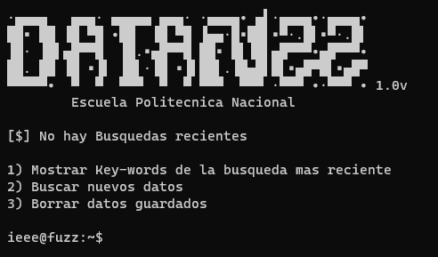

IEEE-Data-Fuzz es una innovadora herramienta que revoluciona la búsqueda de papers científicos al aprovechar la potente API de IEEE. Esta aplicación avanzada ofrece a investigadores, académicos y profesionales una forma eficiente de acceder a la vasta base de datos de IEEE, permitiendo la búsqueda de trabajos académicos con precisión y velocidad incomparables. Con algoritmos de búsqueda inteligentes y una interfaz amigable, IEEE-Data-Fuzz simplifica el proceso de descubrimiento de información crucial en el ámbito científico y tecnológico. Ya no es necesario perder tiempo navegando por innumerables resultados; esta herramienta personalizable y efectiva garantiza una experiencia de búsqueda de papers científicos eficaz y satisfactoria.
***



- Antes de comenzar debes crearte una cuenta en [IEEE API KEY](https://developer.ieee.org)
-  Una vez creada la cuenta, crea una api key e impletentala en IEEapi.py
```python
api_key = "YOUR API HERE"
```

### Dependencias
```bash
pip install requests
pip install json
pip install signal
pip install tabulate
pip install urllib3
```
Instala las dependencias para que el programa funcione correctamente.
### Ejecución del Programa
```bash
python3 main.py
```
